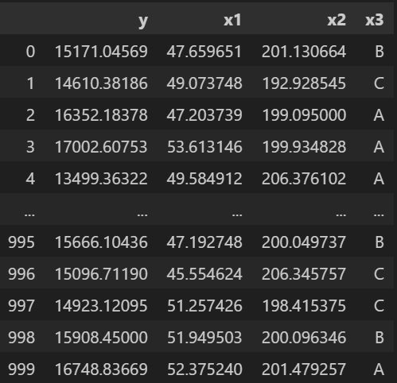
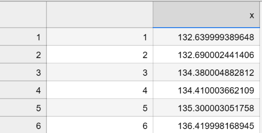

This repository contains 2 python files on the module "Statistics for Python" and a report following IEEE standard template. 

`MLR_8.ipynb` jupyter notebook checks for Gauss-Markov Assumptions on the below sample dataset, builds multiple linear regression models, compares error metrics of each other and residual analysis is plotted.
 

`TS_8.ipynb` jupyter notebook performs a Time Series analysis on a simple dataset. Trends, pattern, seasonality of the dataset is checked using Decomposition technique. Stationarity of the data is checked using approriate tests like Augmented Dickey-Fuller Test. ARIMA and naive models are built to forecast the data and error metrics comparison is made between the 2 models. This analysis is performed on a dataset like below:

